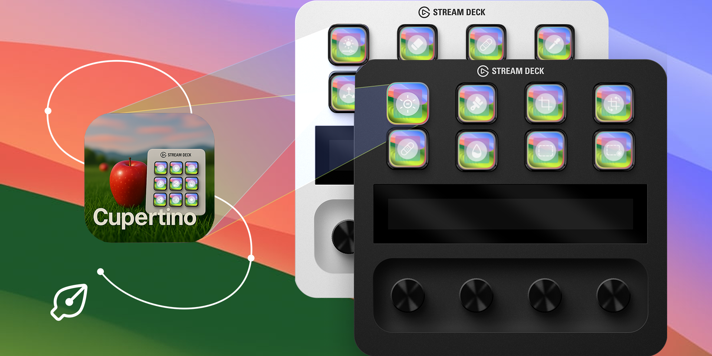
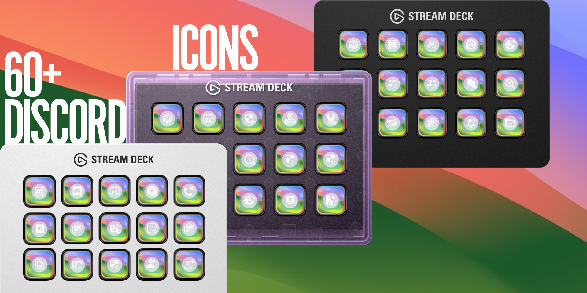
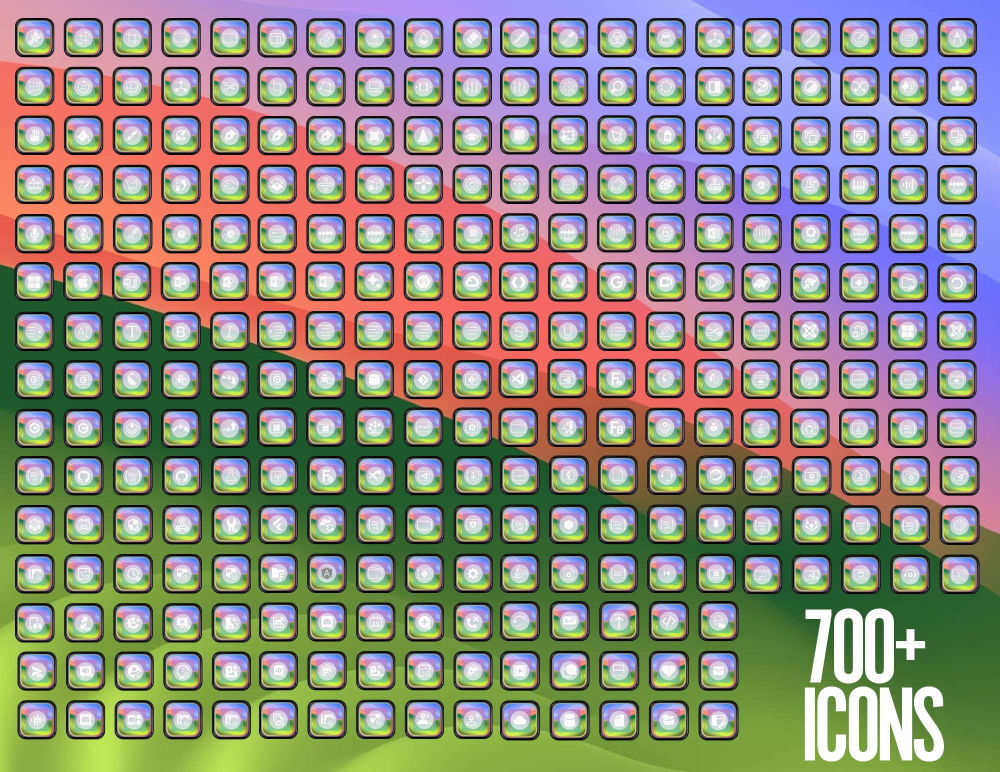
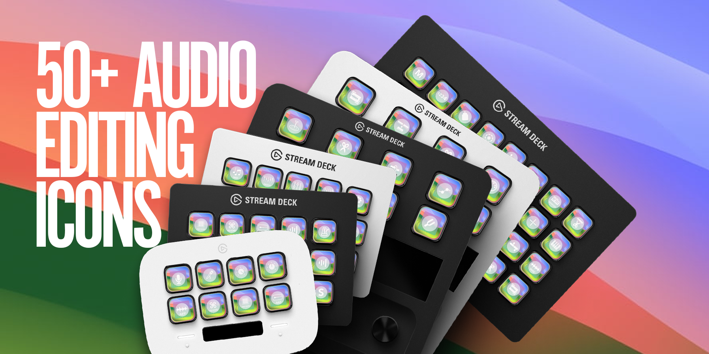

<!-- PROJECT SHIELDS -->
[![Apple-Silicon-Shield]][Apple-Silicon-Shield-url]

[![LinkedIn][linkedin-shield]][linkedin-url]
[![GitHub][GitHub-shield]][GitHub-url]

<!-- PROJECT LOGO -->
 

  

  <h3 align="center">Cupertino</h3>

  

   A Premium Elgato Stream Deck Icon Pack
     
    

<!-- ABOUT THE Icon Pack -->
## About The Project

Introducing **Cupertino** – a premium Elgato Stream Deck Icon Pack:

- **700+ Icons Included**: A beautifully crafted collection for streamers, developers, creatives, and productivity power-users.
- **macOS-Inspired, Windows-Ready**: Sleek design inspired by Apple, fully compatible with Windows.
- **Stream-Ready Setup**: Twitch, Kick, YouTube, OBS, Streamlabs, and more.
- **100+ Microsoft Teams Icons**: Manage calls, meetings, roles, and more.
- **Pro Audio Tools**: 50+ icons for FL Studio, Audacity, Logic Pro, etc.
- **Creative Workflow Icons**: 100+ for Photoshop, Premiere, Lightroom, Final Cut Pro, and more.
- **Built for Developers**: Support for VS Code, Xcode, Android Studio, Eclipse, IntelliJ.
- **Multilingual Coding**: C, C++, Python, Java, JS, HTML, CSS, SQL, and many more.
- **System & Productivity Icons**: Includes icons for macOS, Windows, Google Suite, and Microsoft Office.
- **Discord & Community Tools**: 60+ icons for server roles, chat, bots, moderation, etc.

**Cupertino** isn’t just an icon pack — it’s a workspace upgrade that empowers your workflow and reflects your aesthetic.

(<a href="#readme-top">back to top</a>)

<!-- LICENSE -->

# Released Under End-User License Agreement (EULA)

Cupertino Icon Pack – End-User License Agreement (EULA)

This End-User License Agreement ("Agreement") is between you, the end-user ("User"), and Blaze Wheeler ("Licensor"), creator of the Cupertino Icon Pack (“Cupertino”), hosted at https://github.com/BlazeWheeler/Cupertino.

This Agreement outlines the terms under which you may use the Cupertino icon pack assets. By purchasing, downloading, installing, or using the Cupertino Icon Pack, you agree to be bound by the terms of this Agreement.

<!-- CONTACT -->

<!-- CONTACT -->
## Icon Requests
Create an issue, in the desc please add name and/or resources to requested icon.

## Contact

Blaze Wheeler  - blaze@blazew.me

(<a href="#readme-top">back to top</a>)

<!-- MARKDOWN LINKS & IMAGES -->

[Apple-Silicon-Shield]: https://img.shields.io/badge/Apple-Silicon_M2-999999?style=for-the-badge&logo=apple&logoColor=white
[Apple-Silicon-Shield-url]: https://support.apple.com/en-us/HT211814

[license-shield]: https://img.shields.io/badge/License-Apache%202.0-orange?style=for-the-badge&logo=
[license-url]:https://www.apache.org/licenses/LICENSE-2.0
[linkedin-shield]: https://img.shields.io/badge/-LinkedIn-black.svg?style=for-the-badge&logo=linkedin&colorB=555

[linkedin-url]:https://www.linkedin.com/in/blaze-wheeler-8306a2223/
[GitHub-shield]: 	https://img.shields.io/badge/GitHub-100000?style=for-the-badge&logo=github&logoColor=white
[GitHub-url]: https://github.com/blazeWheeler
[product-screenshot]: images/screenshot.png

[HTML-url]: https://www.w3schools.com/howto/howto_make_a_website.asp
[HTML-badge]: https://img.shields.io/badge/HTML5-E34F26.svg?style=for-the-badge&logo=HTML5&logoColor=white
[CSS-url]: https://www.w3schools.com/css/
[CSS-badge]: https://img.shields.io/badge/CSS3-1572B6.svg?style=for-the-badge&logo=CSS3&logoColor=white

[Javascript-url]: https://www.w3schools.com/js/
[JavaScript-badge]: https://img.shields.io/badge/JavaScript-F7DF1E.svg?style=for-the-badge&logo=JavaScript&logoColor=black

[PHP-url]: https://www.php.net/docs.php
[PHP-badge]: https://img.shields.io/badge/PHP-777BB4.svg?style=for-the-badge&logo=PHP&logoColor=white

[Telegram-url]: https://core.telegram.org/bots/api
[Telegram-badge]: https://img.shields.io/badge/Telegram%20API-26A5E4.svg?style=for-the-badge&logo=Telegram&logoColor=white

[Duq-url]: https://duq.edu
[Duq-badge]:(https://custom-icon-badges.demolab.com/badge/-Duquesne%20University-ba0c2f?style=for-the-badge&logo=duquesne_dukes_logo1)